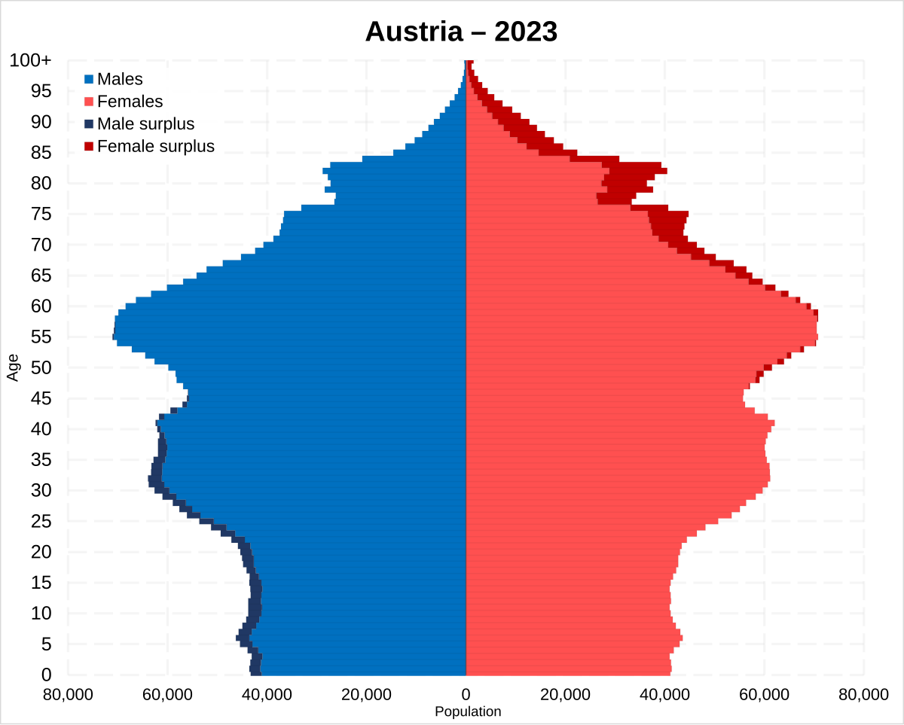

# Cancer Mortality Analysis  
**Date:** 06.10.2025  

This is a README describing the **Cancer Mortality in Austria** project.  
The goal of this project is to **analyze and visualize cancer mortality rates** across Austrian federal provinces, comparing data between **men and women**. The task focuses on exploratory data analysis, identifying patterns, and preparing the dataset for further modeling or statistical inference.  

---

## Data
The data is based on publicly available cancer mortality statistics from **Statistics Austria**  — [https://www.statistik.at](https://www.statistik.at). (downloaded: 06.10.2025.)
It contains the following key variables:
- **Federal province** – Region within Austria  
- **Mortality men** – Number of cancer-related deaths among men  
- **Mortality women** – Number of cancer-related deaths among women  
**Data file:** `data/raw/Cancer_incidence.csv`

## Folder structure 
cancer_mortality_austria/
│
├── code/
│ └── analysis.ipynb
│
├── data/
│ ├── raw/
│  └── Cancer_incidence.csv
│
├── pics/
│ └── demographic.png
│
├── environment.yml
└── README.md

## Getting Started 
The analysis can be run using the main Jupyter notebook: notebooks/analysis.ipynb
This notebook handles:
- Importing and cleaning the raw dataset  
- Filtering relevant columns  
- Creating visualizations  
- Drawing analytical conclusions  

## **Computational Requirements**
- **Hardware**:  
  - Minimum: 4 GB RAM, 2 CPU cores  
  - Recommended: 8 GB RAM, 4 CPU cores  

- **Software**:  
  - Python 3.11+  
  - Libraries: `pandas`, `numpy`, `matplotlib`, `scikit-learn`, `jupyter`, `seaborn`

- **Environment**:  
  - Virtual environment with `venv` or `conda`  
  - Follow [PEP 8](https://peps.python.org/pep-0008/) for coding style  

## Requirements
Option 1 (conda)
`conda env create -f environment.yml`
`conda activate myenv310`
Option 2 (pip)
`pip install -r requirements.txt`

## Steps to Reproduce
1. Clone the repository: `git clone <repo_url>`
2. Create environment: `conda env create -f environment.yml`
3. Activate environment: `conda activate cancer-env`
4. Run notebook: `notebooks/analysis.ipynb` → outputs saved in `results/`

## Example Code
```python
import pandas as pd
import matplotlib.pyplot as plt
import seaborn as sns

data = pd.read_csv("data/austria_cancer_mortality.csv")
sns.lineplot(data=data, x="Year", y="MortalityRate", hue="CancerType")
plt.savefig("results/mortality_plot.png")
plt.show ()
```

## Results
| Federal provinces | Mortality men | Mortality women |
|------------------|---------------|----------------|
| Burgenland        | 464           | 323            |
| Carinthia         | 832           | 680            |
| Lower Austria     | 2485          | 1941           |
| Salzburg          | 629           | 558            |
| Styria            | 1752          | 1492           |
| Tyrol             | 804           | 743            |
| Vorarlberg        | 436           | 339            |
| Vienna            | 2106          | 1919           |

## Demographic distribution of men and women in Austria
Additionally, the demographic composition of Austria by gender is illustrated below.


## Author 
Alina Imanakhunova [https://github.com/alinaiman](https://github.com/alinaiman)
Data Science 1 Student — 2025
Mini Project: Cancer Mortality in Austria 